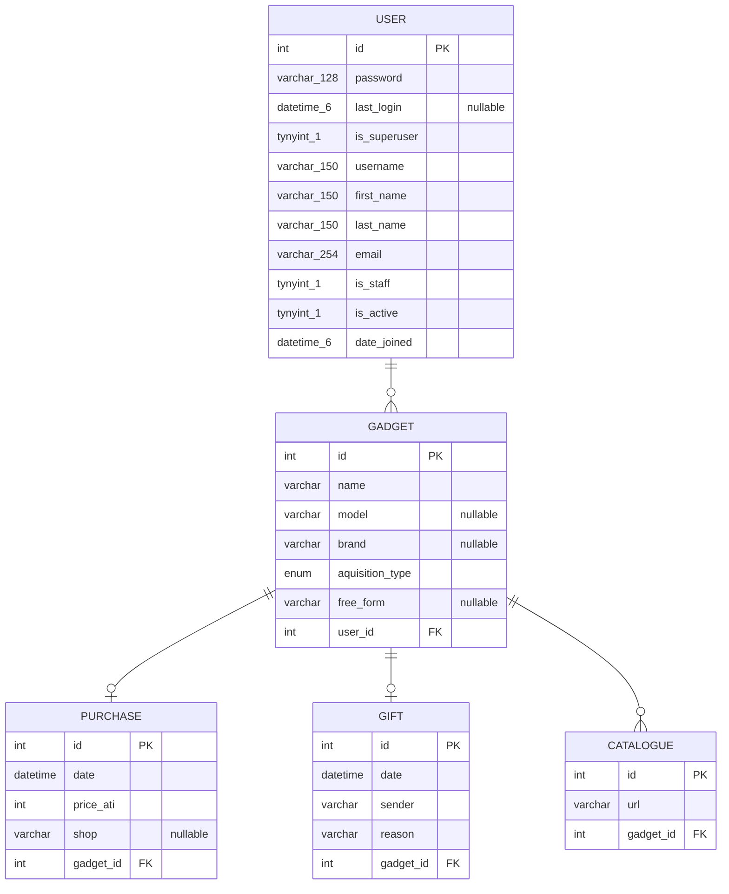

```mermaid
erDiagram
    USER ||--o{ GADGET : ""
    USER {
        int id PK
        varchar_128 password
        datetime_6 last_login "nullable"
        tynyint_1 is_superuser
        varchar_150 username
        varchar_150 first_name
        varchar_150 last_name
        varchar_254 email
        tynyint_1 is_staff
        tynyint_1 is_active
        datetime_6 date_joined
    }
    GADGET ||--o| PURCHASE : ""
    GADGET ||--o| GIFT : ""
    GADGET ||--o{ CATALOGUE : ""
    GADGET {
        int id PK
        varchar name
        varchar model "nullable"
        varchar brand "nullable"
        enum aquisition_type
        varchar free_form "nullable"
        int user_id FK
    }
    PURCHASE {
        int id PK
        datetime date
        int price_ati
        varchar shop "nullable"
        int gadget_id FK
    }
    GIFT {
        int id PK
        datetime date
        varchar sender
        varchar reason
        int gadget_id FK
    }
    CATALOGUE {
        int id PK
        varchar url
        int gadget_id FK
    }

```