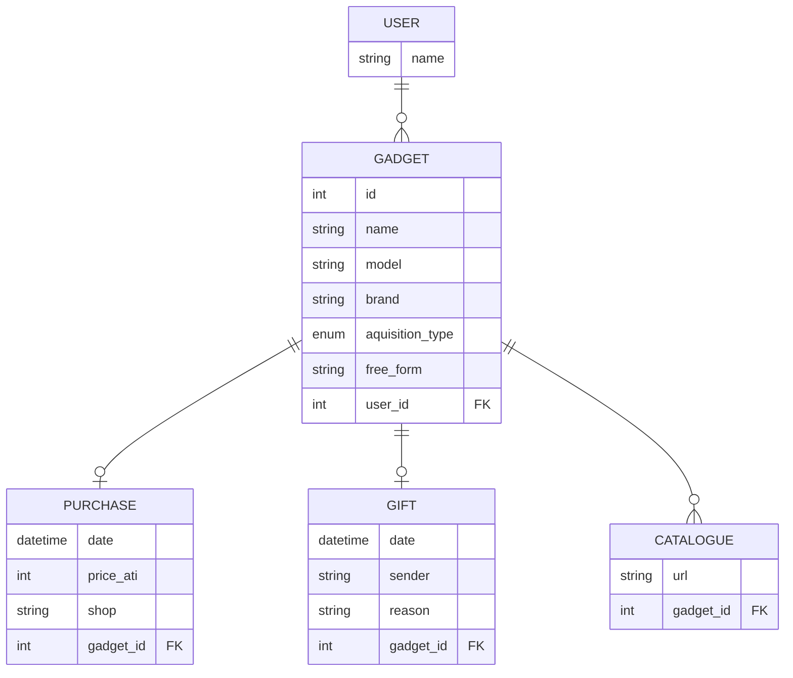

```mermaid
erDiagram
    USER ||--o{ GADGET : ""
    USER {
        string name
    }
    GADGET ||--o| PURCHASE : ""
    GADGET ||--o| GIFT : ""
    GADGET ||--o{ CATALOGUE : ""
    GADGET {
        int id
        string name
        string model
        string brand
        enum aquisition_type
        string free_form
        int user_id FK
    }
    PURCHASE {
        datetime date
        int price_ati
        string shop
        int gadget_id FK
    }
    GIFT {
        datetime date
        string sender
        string reason
        int gadget_id FK
    }
    CATALOGUE {
        string url
        int gadget_id FK
    }

```