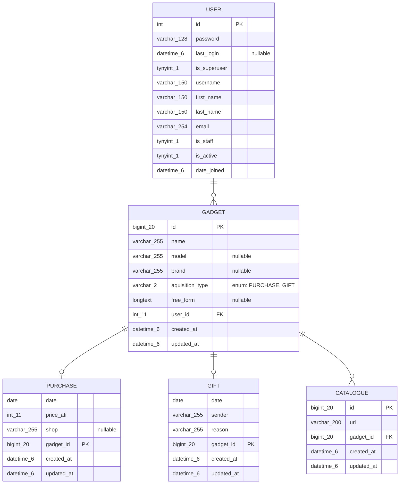

```mermaid
erDiagram
    USER ||--o{ GADGET : ""
    USER {
        int id PK
        varchar_128 password
        datetime_6 last_login "nullable"
        tynyint_1 is_superuser
        varchar_150 username
        varchar_150 first_name
        varchar_150 last_name
        varchar_254 email
        tynyint_1 is_staff
        tynyint_1 is_active
        datetime_6 date_joined
    }
    GADGET ||--o| PURCHASE : ""
    GADGET ||--o| GIFT : ""
    GADGET ||--o{ CATALOGUE : ""
    GADGET {
        bigint_20 id PK
        varchar_255 name
        varchar_255 model "nullable"
        varchar_255 brand "nullable"
        varchar_2 aquisition_type "enum: PURCHASE, GIFT"
        longtext free_form "nullable"
        int_11 user_id FK
        datetime_6 created_at
        datetime_6 updated_at
    }
    PURCHASE {
        date date
        int_11 price_ati
        varchar_255 shop "nullable"
        bigint_20 gadget_id PK
        datetime_6 created_at
        datetime_6 updated_at
    }
    GIFT {
        date date
        varchar_255 sender
        varchar_255 reason
        bigint_20 gadget_id PK
        datetime_6 created_at
        datetime_6 updated_at
    }
    CATALOGUE {
        bigint_20 id PK
        varchar_200 url
        bigint_20 gadget_id FK
        datetime_6 created_at
        datetime_6 updated_at
    }

```