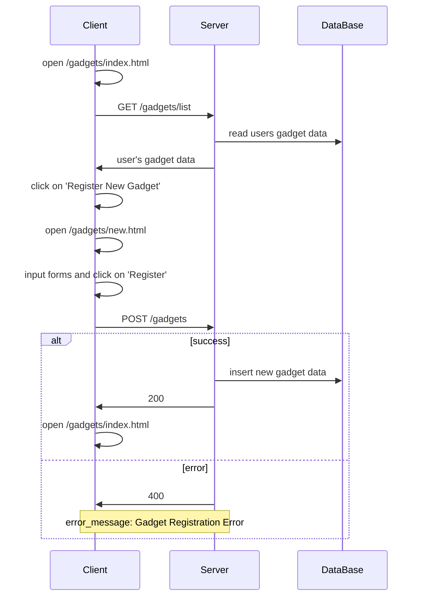
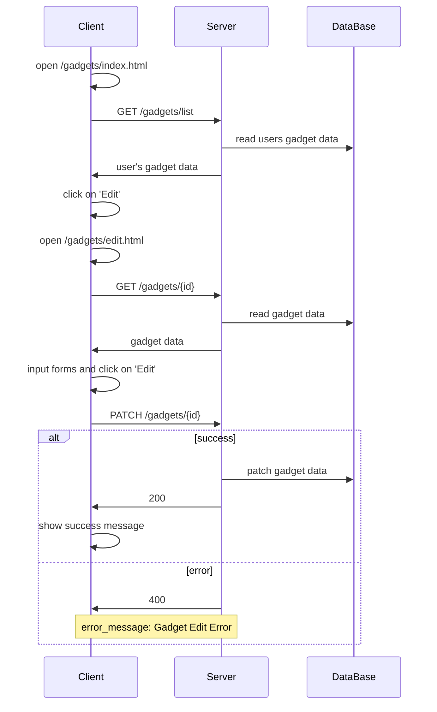
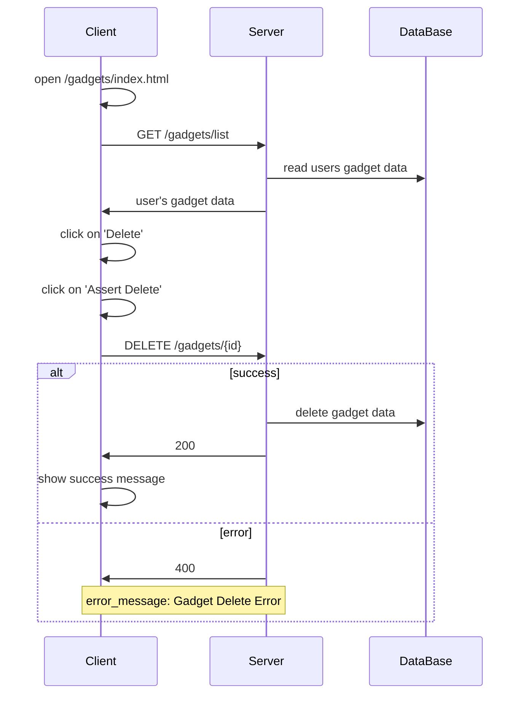

# ガジェット管理の流れ

## ガジェット登録

```mermaid
sequenceDiagram
    participant c as Client
    participant s as Server
    participant d as DataBase
    c->>c: open /gadgets/index.html
    c->>s: GET /gadgets/list
    s->>d: read users gadget data
    s->>c: user's gadget data
    c->>c: click on 'Register New Gadget'
    c->>c: open /gadgets/new.html
    c->>c: input forms and click on 'Register'
    c->>s: POST /gadgets
    alt success
        s->>d: insert new gadget data
        s->>c: 200
        c->>c: open /gadgets/index.html
    else error
        s->>c:400
        Note over c, s: error_message: Gadget Registration Error
    end
```

## ガジェット編集

```mermaid
sequenceDiagram
    participant c as Client
    participant s as Server
    participant d as DataBase
    c->>c: open /gadgets/index.html
    c->>s: GET /gadgets/list
    s->>d: read users gadget data
    s->>c: user's gadget data
    c->>c: click on 'Edit'
    c->>c: open /gadgets/edit.html
    c->>s: GET /gadgets/{id}
    s->>d: read gadget data
    s->>c: gadget data
    c->>c: input forms and click on 'Edit'
    c->>s: PATCH /gadgets/{id}
    alt success
        s->>d: patch gadget data
        s->>c: 200
        c->>c: show success message
    else error
        s->>c:400
        Note over c, s: error_message: Gadget Edit Error
    end
```

## ガジェット削除

```mermaid
sequenceDiagram
    participant c as Client
    participant s as Server
    participant d as DataBase
    c->>c: open /gadgets/index.html
    c->>s: GET /gadgets/list
    s->>d: read users gadget data
    s->>c: user's gadget data
    c->>c: click on 'Delete'
    c->>c: click on 'Assert Delete'
    c->>s: DELETE /gadgets/{id}
    alt success
        s->>d: delete gadget data
        s->>c: 200
        c->>c: show success message
    else error
        s->>c:400
        Note over c, s: error_message: Gadget Delete Error
    end
```